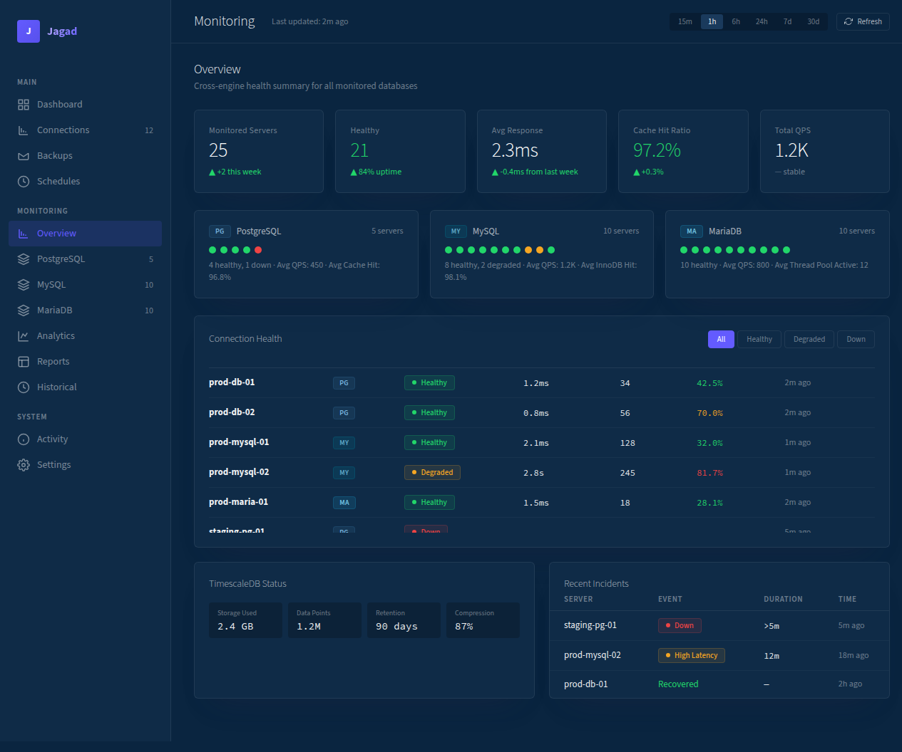
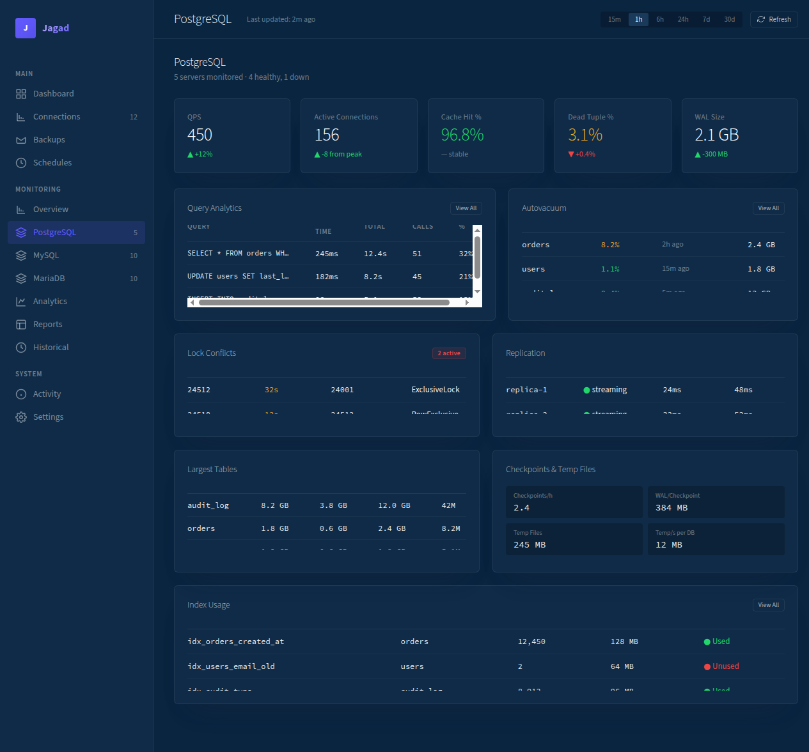
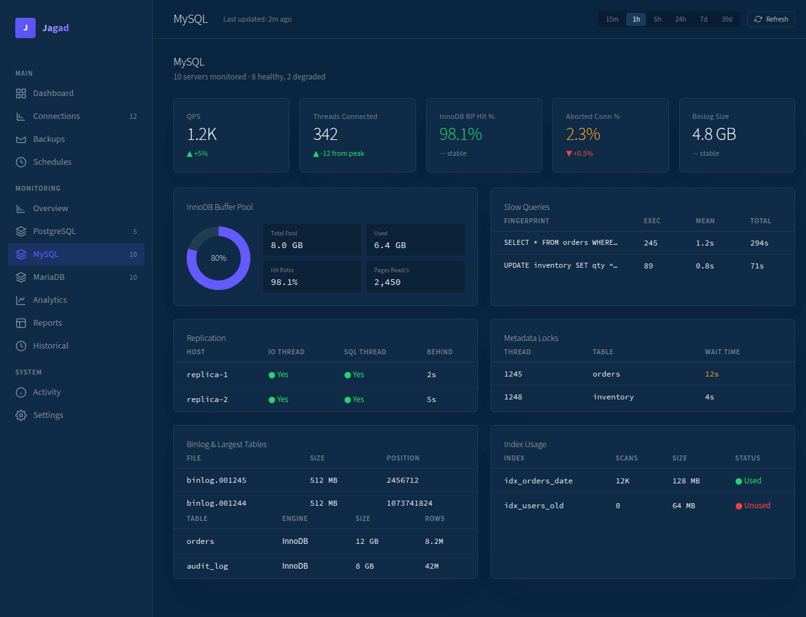
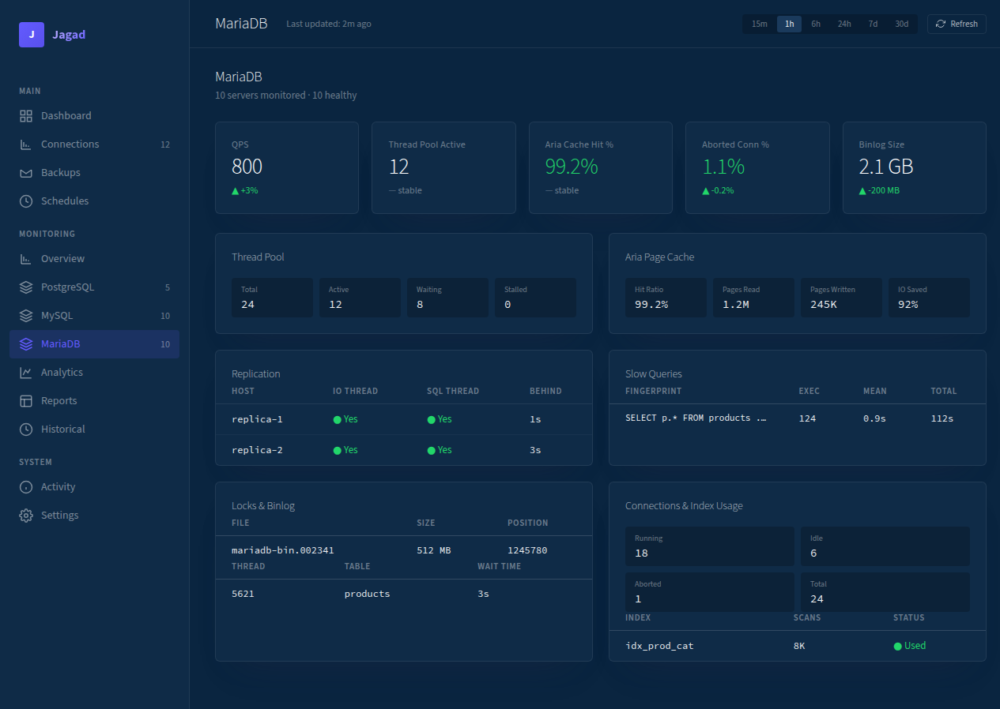
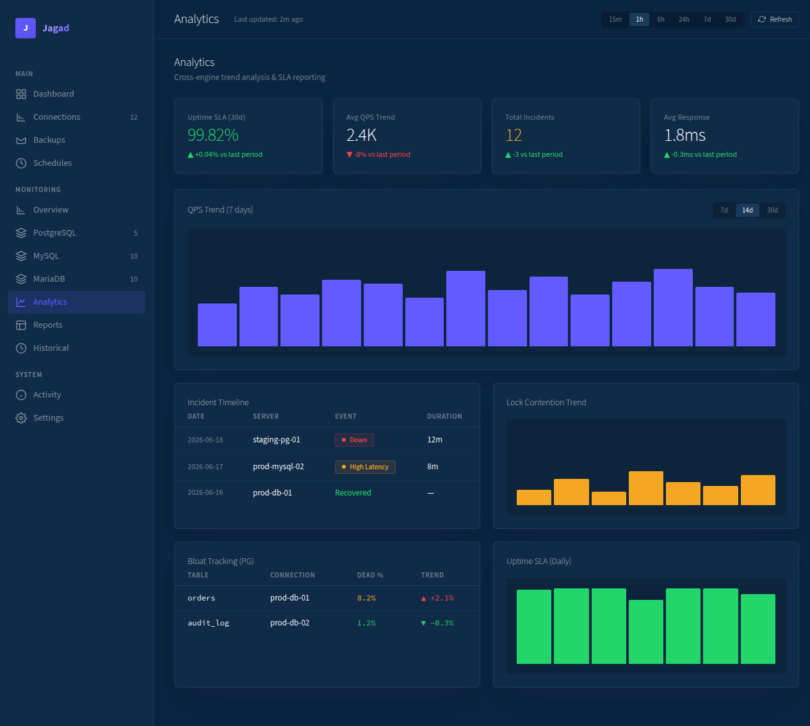
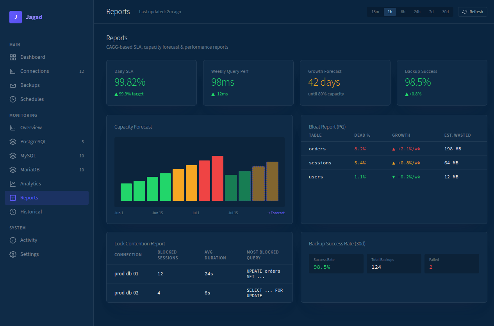
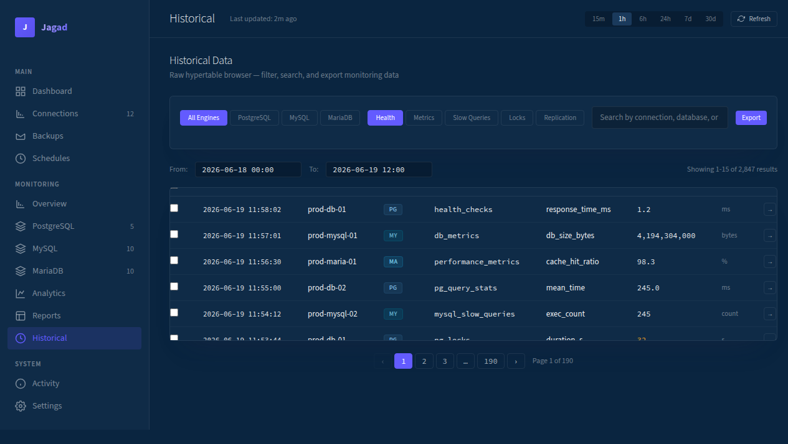

# PRD: Jagad Revamp v3

**Status:** Draft v3  
**Author:** Hermes + Endang Suwarna  
**Last Updated:** 2026-06-19  v3.2  \
**Design System:** Stripe-inspired (dark navy canvas, purple accent, Source Sans 3 light weight)
**Related:** PRD-monitoring.md, [Percona PMM](https://www.percona.com/monitoring/), [pgBadger](https://pgbadger.darold.net/), [Datadog DB Monitoring](https://www.datadoghq.com/product/database-monitoring/)

---

## 1. Executive Summary

Jagad saat ini menggunakan satu schema (`public`) untuk menyimpan *semua* data — baik data relasional (connections, backups, schedules) maupun data time-series monitoring (health_checks, db_metrics, performance_metrics). Hal ini menyebabkan:

- **Retention management** sulit (data time-series butuh auto-delete, data relasional butuh persist)
- **Backup/restore** membengkak (ikut backup data metrik yang sebenarnya bisa diregenerasi)
- **Permission granularity** rendah
- **Compression policy** tidak bisa di-target per use-case

Selain itu, monitoring belum dipisah per-engine (PostgreSQL, MySQL, MariaDB punya metric yang berbeda fundamental), UI masih perlu di-improve dari sisi usability, dan reporting agregat (SLA, capacity planning) belum ada.

Revamp ini mencakup **schema restructure** (database) + **UI overhaul** (Stripe-inspired dark navy design system) + **per-engine monitoring** secara bersamaan.

---

## 2. Problem Statement

### 2.1 Database
1. **Single schema (`public`)** mencampur data dengan karakteristik retention berbeda
2. **TimescaleDB hypertable** tidak bisa di-compress/retention secara independen dari tabel relasional
3. **Backup database** menjadi besar karena ikut backup data metrik (yang bisa dibuang setelah 90 hari)
4. **Migrasi ke depannya** makin sulit karena schema `public` sudah penuh

### 2.2 Monitoring (Baru v3)
1. **Metric jadi generik** — `performance_metrics` dipaksa menampung `pg_stat_statements` dan `slow_log` dalam model yang sama
2. **Frontend jadi generic** — Grid/Analytics/List/Historical nampilin layout sama buat semua engine
3. **Data campur retention** — data time-series (7-90 hari) dan data relasional (forever) dalam schema yang sama
4. **Reporting agregat belum ada** — capacity planning, SLA uptime, slow query regression
5. **Collector tanpa rate limiting** — semua metric dikumpulin tiap 60 detik, termasuk query berat (`pg_stat_statements`, `information_schema.TABLES`)
6. **Partial failure tidak tertangani** — gagal 1 metric, seluruh collect cycle terpengaruh
7. **Engine-specific gaps** — PG belum punya checkpoint & temp file tracking; MariaDB belum punya connections, locks, & binlog monitors; index usage cuma ada di PG (MySQL & MariaDB tidak)
8. **3 new CAGG dibutuhkan** — bloat tracking (PG), lock contention trend harian, capacity forecast untuk growth projection

### 2.3 UI
1. **Dashboard** — flat, cuma stat row + activity + recent backups table, kurang impactful sebagai landing page
2. **Connections** — plain table tanpa search/filter, perlu page-switching buat liat detail
3. **Backups** — cuma table list, ga ada visual timeline atau batch action
4. **Schedules** — card biasa tanpa health indicator atau countdown
5. **Monitoring tabs** — nama "Grid/Analytics/List" kurang intuitif

### 2.4 Bugs Teridentifikasi di Monitoring
1. **Data Points: 0** — `QuerySummary` arg binding broken, P2 hypertables tanpa filter waktu
2. **Largest Tables 10 baris identik** — `QueryTableMetrics` return semua time-series snapshot tanpa dedup
3. **Analytics QPS KPI —** — Aggregation issue di cross-connection

---

## 3. Goals & Success Metrics

| Goal | Metric | Current | Target |
|---|---|---|---|
| Schema separation | Number of schemas | 1 (`public`) | 2 (`jagad`, `monitoring`) |
| Data retention | Auto-drop metrics >90 days | Manual | Automatic via TimescaleDB policy |
| Per-engine monitoring | Pages per engine | 0 (generic) | 3 (PG, MySQL, MariaDB) |
| Engine-specific collector | Collector functions | 1 generic | 3 engine-specific (8-10 metric per engine) |
| KPI cards berbeda per engine | KPI relevance | Generic | Engine-specific metrics |
| Continuous Aggregates | Reporting views | 0 | 8 CAGGs auto-refresh |
| Engine metric completeness | Hypertables per engine | PG: 8, MySQL: 7, MariaDB: 5 | PG: 10, MySQL: 8, MariaDB: 9 |
| UI clarity | User confusion on tab names | Medium | Zero |
| Stripe design system | CSS tokens implemented | Linear-inspired #818cf8 | Stripe-inspired #635BFF, dark navy canvas |
| Dashboard usefulness | Actions taken from dashboard | Low | High (KPI-driven) |
| Connections UX | Time to find connection info | ~30s (page switch) | ~5s (inline expand) |
| Collector rate limiting | Light/heavy query interval | All 60s | Light 60s, Medium 5m, Heavy 1h |
| Partial failure handling | Error per metric | Abort all | Log + continue |

---

## 4. Schema Architecture

### 4.1 Target Schema Design

```
Schema: jagad  — Relational data (persistent, no auto-delete)
└── public
    ├── connections
    ├── connection_databases
    ├── storage_providers
    ├── schedules
    ├── backups
    ├── restores
    ├── notifications
    ├── encryption_keys
    └── app_settings

Schema: monitoring  — TimescaleDB hypertables + Continuous Aggregates
├── Generic (cross-engine)
│   ├── health_checks              ← source of truth buat overall status
│   └── db_metrics                 ← db size, connections, qps
│
├── PostgreSQL-specific
│   ├── pg_query_stats             ← pg_stat_statements
│   ├── pg_autovacuum              ← pg_stat_user_tables
│   ├── pg_replication             ← pg_stat_replication
│   ├── pg_locks                   ← pg_locks
│   ├── pg_tables                  ← pg_stat_user_tables
│   ├── pg_index_usage             ← pg_stat_user_indexes
│   ├── pg_wal_stats               ← pg_stat_wal
│   ├── pg_checkpoints             ← pg_stat_checkpoints, WAL per checkpoint
│   ├── pg_temp_files              ← pg_stat_database (temp_bytes, temp_files)
│   └── pg_connections             ← pg_stat_activity
│
├── MySQL-specific
│   ├── mysql_innodb_metrics       ← InnoDB buffer pool, row ops
│   ├── mysql_replication          ← SHOW SLAVE STATUS
│   ├── mysql_slow_queries         ← performance_schema / slow_log
│   ├── mysql_locks                ← metadata locks + InnoDB locks
│   ├── mysql_tables               ← information_schema.tables
│   ├── mysql_binlog               ← binlog size, position
│   ├── mysql_index_usage          ← index scan stats, unused indexes
│   └── mysql_connections          ← SHOW PROCESSLIST
│
├── MariaDB-specific
│   ├── mariadb_thread_pool        ← thread_pool_stats
│   ├── mariadb_aria_cache         ← Aria pagecache
│   ├── mariadb_replication        ← SHOW SLAVE STATUS
│   ├── mariadb_slow_queries       ← slow_log
│   ├── mariadb_tables             ← information_schema.tables
│   ├── mariadb_locks              ← metadata locks + InnoDB locks
│   ├── mariadb_binlog             ← binlog size, position
│   ├── mariadb_index_usage        ← index scan stats, unused indexes
│   └── mariadb_connections        ← SHOW PROCESSLIST
│
├── Incidents
│   └── incidents                  ← dari health_checks (down/degraded events)
│
└── Continuous Aggregates (CAGG)
    ├── cagg_daily_uptime          ← 1yr retention
    ├── cagg_daily_qps             ← 1yr retention
    ├── cagg_weekly_query_stats    ← 1yr retention
    ├── cagg_monthly_growth        ← 1yr retention
    ├── cagg_daily_backup_rate     ← 1yr retention
    ├── cagg_weekly_bloat_tracking ← 1yr retention (PG specific — dead tuple ratio per table)
    ├── cagg_daily_lock_contention ← 1yr retention (blocked session duration per connection)
    └── cagg_monthly_capacity      ← 1yr retention (growth projection — db_size trend)
```

### 4.2 Hubungan Generic vs Engine-Specific Tables

```
health_checks  ──┬── source of truth buat overall status (UP/DOWN/DEGRADED)
                 ├── basis buat incidents & uptime SLA
                 └── response_time_ms sebagai health indicator

db_metrics     ──┬── generic cross-engine: db_size, connections_total, qps
                 └── cache_hit_ratio — asal data beda per engine, method collect berbeda

pg_* / mysql_* / mariadb_*  ── engine-specific detailed data
                                tidak ada di health_checks / db_metrics
                                diakses langsung dari per-engine page frontend

Alur data:
  Overview page   → health_checks + db_metrics (KPI ringkas)
  PG page         → pg_* tables (deep dive)
  MySQL page      → mysql_* tables (deep dive)
  MariaDB page    → mariadb_* tables (deep dive)

Health status tetap dari health_checks.
Engine-specific tables hanya untuk deep-dive metrics.
```

### 4.3 Migration Strategy

1. **`CREATE SCHEMA monitoring;`**
2. **Create hypertables** di `monitoring` schema (30 tabel)
3. **Set retention + compression policies** per hypertable
4. **Create continuous aggregates** (8 CAGG)
5. **Refactor kode** update query ke schema baru
6. **Drop old P2 tables** dari `public`: `autovacuum_info`, `lock_info`, `replication_lag`, `table_metrics`

**Rollback plan:** `DROP SCHEMA monitoring CASCADE;` — data bisa di-recollect dari awal.
Karena belum ada user & data existing → drop & recreate is fine.
Migration SQL auto-run via `docker compose up`.

### 4.4 Audit Log (Schema `logs`)

*Removed from v3 — audit log akan dimasukkan di revamp terpisah.*

---

## 5. Retention Policy

| Hypertable | Chunk Interval | Retention | Compression After |
|---|---|---|---|
| health_checks | 1 day | 7 days | 2 days |
| db_metrics | 1 day | 30 days | 7 days |
| pg_query_stats | 1 day | 30 days | 2 days |
| pg_autovacuum | 1 day | 30 days | 7 days |
| pg_replication | 1 day | 7 days | 1 day |
| pg_locks | 1 day | 7 days | 1 day |
| pg_tables | 7 days | 90 days | 14 days |
| pg_index_usage | 7 days | 90 days | 14 days |
| pg_wal_stats | 1 day | 7 days | 1 day |
| pg_connections | 1 day | 7 days | 1 day |
| pg_checkpoints | 1 day | 7 days | 1 day |
| pg_temp_files | 1 day | 7 days | 1 day |
| mysql_innodb_metrics | 1 day | 30 days | 7 days |
| mysql_replication | 1 day | 7 days | 1 day |
| mysql_slow_queries | 1 day | 30 days | 2 days |
| mysql_locks | 1 day | 7 days | 1 day |
| mysql_tables | 7 days | 90 days | 14 days |
| mysql_binlog | 1 day | 30 days | 7 days |
| mysql_connections | 1 day | 7 days | 1 day |
| mysql_index_usage | 7 days | 90 days | 14 days |
| mariadb_thread_pool | 1 day | 30 days | 7 days |
| mariadb_aria_cache | 1 day | 30 days | 7 days |
| mariadb_replication | 1 day | 7 days | 1 day |
| mariadb_slow_queries | 1 day | 30 days | 2 days |
| mariadb_tables | 7 days | 90 days | 14 days |
| mariadb_locks | 1 day | 7 days | 1 day |
| mariadb_binlog | 1 day | 30 days | 7 days |
| mariadb_index_usage | 7 days | 90 days | 14 days |
| mariadb_connections | 1 day | 7 days | 1 day |
| incidents | 1 day | 90 days | 7 days |
| cagg_daily_* | — | 365 days | — |

---

## 6. UI Architecture — Pages & Components

### 6.1 Global Design System — Stripe-inspired

Stripe's signature: **dark navy canvas, weight-300 typography, blue-tinted shadows, conservative border radius.**

#### Color Palette

| Token | Value | Usage |
|---|---|---|
| **Canvas** | `#0A2540` | Page background — Stripe's dark navy |
| **Surface** | `#0F2B47` | Card backgrounds, sidebar |
| **Elevated** | `#1a3a5c` | Hover states, modal surfaces |
| **Accent** | `#635BFF` | Primary brand color, CTA, active states |
| **Accent Hover** | `#5850EC` | Button hover, link hover |
| **Accent Light** | `#7a73ff` | Subtle accent backgrounds, focus rings |
| **Text Primary** | `rgba(255,255,255,0.95)` | Headings, labels |
| **Text Secondary** | `rgba(255,255,255,0.65)` | Body text, descriptions |
| **Text Tertiary** | `rgba(255,255,255,0.4)` | Metadata, timestamps |
| **Text Sidebar** | `rgba(255,255,255,0.45)` | Sidebar navigation links |
| **Border** | `rgba(255,255,255,0.08)` | Card borders, dividers |
| **Border Hover** | `rgba(255,255,255,0.15)` | Card hover border |
| **Border Accent** | `rgba(99,91,255,0.3)` | Active/selected state borders |

#### Status Colors

| Status | Color | Background | Border |
|---|---|---|---|
| **Healthy** | `#22d66a` | `rgba(34,214,106,0.1)` | `rgba(34,214,106,0.2)` |
| **Degraded** | `#f5a623` | `rgba(245,166,35,0.1)` | `rgba(245,166,35,0.2)` |
| **Down** | `#ef4444` | `rgba(239,68,68,0.1)` | `rgba(239,68,68,0.2)` |
| **Info** | `#3b82f6` | `rgba(59,130,246,0.1)` | `rgba(59,130,246,0.2)` |

#### Typography

- **Primary:** `'Source Sans 3'` — Stripe-like light weight (300), `-apple-system`, `system-ui` fallback
- **Monospace:** `'Source Code Pro'`, `'JetBrains Mono'`, `SF Mono`, `monospace`
- **Signature weight:** **300** for KPI values and headings — lightweight, premium feel
- **Weight 400** for UI elements (buttons, nav links, table cells)
- **Letter-spacing:** Negative tracking at display sizes (KPI values: `-0.5px`, section headers: `-0.3px`)
- **Font-feature-settings:** `"ss01"` on body text (Stripe signature), `"tnum"` on numeric data (tabular numbers)

#### Shadow System

Stripe's signature blue-tinted multi-layer shadows:

| Level | Shadow | Usage |
|---|---|---|
| **Flat** | None | Page background, inline text |
| **Card** | `rgba(50,50,93,0.25) 0px 30px 45px -30px, rgba(0,0,0,0.1) 0px 18px 36px -18px` | Standard cards, content panels |
| **Elevated** | `rgba(3,3,39,0.25) 0px 14px 21px -14px, rgba(0,0,0,0.1) 0px 8px 17px -8px` | Modals, dropdowns |
| **Hover** | Intensify card shadow on hover | Interactive cards |

#### Border Radius

- **4px** — buttons, inputs, badges, status pills (Stripe conservative)
- **6px** — cards, sidebar items, nav buttons
- **8px** — modals, dropdowns, larger containers
- **12px** — featured cards, hero panels (rare)

#### Card Style

```
┌──────────────────────────────────┐
│  Card Title                      │  ← Source Sans 3 w300, -0.3px tracking
│  ┌──────────────────────────────┐│
│  │  Card content                ││  ← bg: #0F2B47
│  │                              ││  ← border: 1px solid rgba(255,255,255,0.08)
│  │                              ││  ← radius: 6px
│  │                              ││  ← shadow: rgba(50,50,93,0.25) ...
│  └──────────────────────────────┘│
│  Card footer (optional)          │  ← text-tertiary, 12px
└──────────────────────────────────┘
```

### 6.2 Navigation (Sidebar)

```
MAIN
├── Dashboard              ← KPI-driven landing page
├── Connections [12]       ← Search + filter + expandable rows
├── Backups                ← Timeline calendar + batch actions
├── Schedules              ← Ring indicator cards

MONITORING (NEW — Per-Engine)
├── Overview               ← Health KPI all engines
├── PostgreSQL [5]         ← Deep dive PG-specific
├── MySQL [10]             ← Deep dive MySQL-specific
├── MariaDB [10]           ← Deep dive MariaDB-specific
├── Analytics              ← Cross-engine trends
├── Reports                ← CAGG-based SLA & capacity
└── Historical             ← Raw hypertable browser

MANAGEMENT
├── Storage                ← CRUD (existing, minor polish)
├── Notifications          ← CRUD (existing, minor polish)

SYSTEM
├── Activity               ← Timeline (existing, minor polish)
├── Settings               ← Form (existing)
```

### 6.3 Page: Dashboard
**Problem:** Flat, low information density, no quick actions.

**Solution:**
- **KPI Row** (5 cards): Total Databases, Backups Today, Success Rate, Storage Used, Monitored Servers — each with mini trend arrow
- **Backup Success Chart:** 30-day bar chart (green=success, red=fail) + summary stats
- **Quick Actions Grid** (4 cards): Run Backup, Add Connection, View Monitoring, Configure Schedule
- **Recent Activity Feed:** Timeline of latest events (color-coded by type)

### 6.4 Page: Connections
**Problem:** Plain table, no filter, need page switch for details.

**Solution:**
- **Search bar** — filter by name, host, or database
- **Filter pills** — All / PostgreSQL / MySQL / MariaDB / Online / Offline
- **Status badges** — Online 🟢 / Warning 🟡 / Offline 🔴
- **Expandable rows** — klik row → show: connection string, version, total size, + 3 recent backups
- **DB count** per connection, **last backup status** visible in table

### 6.5 Page: Backups
**Problem:** Table only, no visual overview, no batch actions.

**Solution:**
- **Stats row** — Total Backups (30d), Failed, Total Size, Avg Duration
- **Timeline Calendar** — 30-day heatmap grid (dark = backup ran, red = failed, outlined = today)
- **By Connection** — distribution bars showing backup count per connection
- **Batch Actions Bar** — check multiple backups → Delete / Restore / Download
- **Enhanced table** — database name, connection, size, status badge, time, duration

### 6.6 Page: Schedules
**Problem:** Static cards, no health visibility.

**Solution:**
- **Schedule cards** with SVG ring indicator (success rate 0-100%)
  - Green ring (≥80%), Yellow ring (50-79%), Red ring (<50%)
  - Center percentage label
- **Next run countdown** — "Next: 02:00 (8h 23m)"
- **Success ratio** — "28/30 succeeded"
- **Edit / Disable** buttons per card
- **Add New Schedule** — dashed border card at bottom

### 6.7 Monitoring Pages (NEW v3) — Stripe Card Layout

Semua monitoring pages menggunakan **Stripe card style**: dark navy surface cards (`#0F2B47`) dengan border `rgba(255,255,255,0.08)`, radius `6px`, dan blue-tinted shadow `rgba(50,50,93,0.25)`.

Setiap section card memiliki:
- **Header:** Source Sans 3 weight 300, `14px`, letter-spacing `-0.2px`, text-secondary
- **Content:** Cards atau tables di dalamnya
- **Stripe KPI cards:** `28px` weight 300 value, label `12px` weight 400 text-tertiary, delta arrow dengan warna status

#### 6.7.1 Overview Page (`#monitoring`)

```
┌──────────────────────────────────────────────────┐
│  Monitoring Overview                              │
│  ┌─ KPI Row ────────────────────────────────────┐│
│  │ Total  │ Healthy │ Avg Resp│ Cache Hit│ QPS  ││
│  │ 25     │ 21/25   │ 2.3ms   │ 97.2%    │ 1.2K ││
│  └──────────────────────────────────────────────┘│
│  ┌─ Per-Engine Summary ─────────────────────────┐│
│  │ ┌─ PostgreSQL (5) ─┐ ┌─ MySQL (10) ────────┐││
│  │ │ ● ● ● ● ○        │ │ ● ● ● ● ● ● ● ● ○ ○ │││
│  │ │ 4 healthy, 1 down │ │ 8 healthy, 2 degraded││
│  │ │ Avg QPS: 450     │ │ Avg QPS: 1.2K       ││
│  │ └──────────────────┘ └──────────────────────┘││
│  │ ┌─ MariaDB (10) ───────────────────────────┐ ││
│  │ │ ● ● ● ● ● ● ● ● ● ●                      │ ││
│  │ │ 10 healthy        │ Avg QPS: 800          │ ││
│  │ └───────────────────────────────────────────┘ ││
│  └──────────────────────────────────────────────┘│
│  ┌─ TimescaleDB Panel ─────────────────────────┐│
│  │ Storage│ Data Points│ Retention│ Compression ││
│  └──────────────────────────────────────────────┘│
│  ┌─ Incidents ─────────────────────────────────┐│
│  └──────────────────────────────────────────────┘│
└──────────────────────────────────────────────────┘
```

#### 6.7.2 PostgreSQL Page (`#monitoring/pg`)
KPI Cards: QPS | Active Connections | Cache Hit % | Dead Tuple % | WAL Size

Sections:
- **Query Analytics** — load-ranked sortable table (mean, total, calls), filter by time
- **Autovacuum Status** — table, dead%, last vacuum, mod since, bloat estimate
- **Replication** — app name, state, write/flush/replay lag
- **Locks** — blocked PID, duration, blocking PID, deadlock flag
- **Largest Tables** — table, size, index, total, rows (dedup per connection)
- **Index Usage** — unused indexes with scan count & size
- **WAL Stats** — WAL size, write frequency
- **Checkpoints** — checkpoint frequency, WAL per checkpoint, buffers written
- **Temp Files** — temp file size per database, indicator work_mem tuning

#### 6.7.3 MySQL Page (`#monitoring/mysql`)
KPI Cards: QPS | Threads Connected | InnoDB BP Hit % | Aborted Conn % | Binlog Size

Sections:
- **InnoDB Buffer Pool** — donut chart (used/free), hit ratio, pages read/written
- **Replication** — IO/SQL thread, seconds behind master, binlog position
- **Slow Queries** — fingerprint, exec count, mean time
- **Metadata Locks** — thread, table, wait time
- **Largest Tables** — table, engine, size, rows
- **Binlog** — file name, size, position
- **Index Usage** — unused indexes with scan count, index size, table
- **Connections** — thread count, running, idle, aborted

#### 6.7.4 MariaDB Page (`#monitoring/mariadb`)
KPI Cards: QPS | Thread Pool Active | Aria Cache Hit % | Aborted Conn % | Binlog Size

Sections:
- **Thread Pool** — thread count, active, waiting, stalled
- **Aria Page Cache** — hit ratio, pages read/written, IO saved
- **Replication** — IO/SQL thread, seconds behind master
- **Slow Queries** — fingerprint, exec count, mean time
- **Largest Tables** — table, engine, size, rows
- **Metadata Locks** — thread, table, wait time
- **Binlog** — file name, size, position
- **Index Usage** — unused indexes with scan count, index size, table
- **Connections** — thread count, running, idle, aborted

#### 6.7.5 Analytics Page (`#monitoring/analytics`)
- Period comparison (current vs previous period)
- QPS trend chart (zoomable)
- Incident timeline
- Uptime SLA chart (daily/weekly breakdown)
- Lock contention trend — blocked session count & average duration per day
- Bloat tracking (PG) — dead tuple ratio trend per table

#### 6.7.6 Reports Page (`#monitoring/reports`)
- Daily uptime SLA (from `cagg_daily_uptime`)
- Weekly query performance (from `cagg_weekly_query_stats`)
- Growth forecast (from `cagg_monthly_growth`)
- Backup success rate (from `cagg_daily_backup_rate`)
- Capacity forecast — db_size trend projection, estimated time-to-full (from `cagg_monthly_capacity`)
- Lock contention report — per-connection blocked session duration, most-blocked queries (from `cagg_daily_lock_contention`)
- Bloat report (PG) — dead tuple ratio growth per table, top-N bloated tables (from `cagg_weekly_bloat_tracking`)

#### 6.7.7 Historical Page (`#monitoring/historical`)
- Filterable hypertable browser per engine
- Engine filter pills, date range, raw data table
- Paginated results

### 6.8 Connection Selector & Filter Persistence UX

#### Connection Selector

Setiap monitoring page (kecuali Overview) punya **connection selector dropdown** di bagian atas halaman.

| Page | Filter Scope | Default |
|---|---|---|
| **Overview** | ❌ No selector (aggregate all) | — |
| **PostgreSQL** | ✅ Hanya koneksi PostgreSQL | "All Connections (N)" |
| **MySQL** | ✅ Hanya koneksi MySQL | "All Connections (N)" |
| **MariaDB** | ✅ Hanya koneksi MariaDB | "All Connections (N)" |
| **Analytics** | ✅ Semua engine, grouped by type | "All Connections (N)" |
| **Reports** | ✅ Semua engine, grouped by type | "All Connections (N)" |
| **Historical** | ✅ Semua engine, grouped by type | "All Connections (N)" |

**Design (Stripe-inspired):**
```
┌────────────────────────────────────────────────────┐
│  ┌─ All Connections (5) ────────▼─┐               │
│  │ 🗄️ All Connections (5)         │               │
│  ├─────────────────────────────────┤               │
│  │ ● prod-db-1     pg01.example.com│               │
│  │ ● prod-db-2     pg02.example.com│               │
│  │ ● staging-pg    stg.example.com│               │
│  │ ● analytics-pg  etl.example.com│               │
│  │ ─ ─ ─ ─ ─ ─ ─ ─ ─ ─ ─ ─ ─ ─ │               │
│  │ 🔴 archive-pg   arc.example.com│               │
│  └─────────────────────────────────┘               │
└────────────────────────────────────────────────────┘
```

Setiap item di dropdown punya:
- **Status dot** 🟢 sehat / 🟠 degraded / 🔴 down
- **Nama koneksi** (bold)
- **Host** (monospace, text-tertiary)
- **Divider** untuk pisahin yang lagi down dari yang sehat

Per-engine pages (PG/MySQL/MariaDB) — dropdown cuma nampilin koneksi sesuai engine.
Cross-engine pages (Analytics/Reports/Historical) — dropdown grouped by engine label:

```
┌─ All Connections (25) ───────▼─┐
│ ● All Connections 25 servers    │
│ ─ ─ ─ ─ ─ ─ ─ ─ ─ ─ ─ ─ ─ ─  │
│ POSTGRESQL (5)                  │
│ ● prod-db-1         pg01       │
│ ● prod-db-2         pg02       │
│ MYSQL (10)                      │
│ ● prod-mysql-1      mysql01    │
│ MARIADB (10)                    │
│ ● prod-maria-1      maria01    │
└─────────────────────────────────┘
```

#### Filter Persistence

**Aturan:** Setiap pindah page engine, filter **reset ke default**.
```
#monitoring/pg      → connection filter: "All Connections"
→ klik link ke #monitoring/mysql
#monitoring/mysql   → connection filter: "All Connections" (reset)
```
Alasan: Engine beda → connection list beda. "Test PG" tidak valid di MySQL page.

Untuk persistence dalam 1 page: pake URL query params:
```
#monitoring/pg?connection=abc123&time=24h&sort=load
```
Bisa di-bookmark / di-share.

---

## 7. Collector Architecture

### 7.1 Rate Limiting per Metric

```
Collector (cycle utama tiap 60 detik)
├── Untuk setiap connection:
│   ├── health_check        → monitoring.health_checks     ← 60 detik (ringan)
│   └── db_metrics          → monitoring.db_metrics        ← 60 detik (ringan)
│
├── [jika PG] collectPG()
│   ├── query_stats         → monitoring.pg_query_stats    ← 5 MENIT (berat)
│   ├── autovacuum          → monitoring.pg_autovacuum     ← 5 MENIT (berat)
│   ├── replication         → monitoring.pg_replication    ← 60 detik (ringan)
│   ├── locks               → monitoring.pg_locks          ← 60 detik (ringan)
│   ├── tables              → monitoring.pg_tables         ← 5 MENIT (berat)
│   ├── index_usage         → monitoring.pg_index_usage    ← 1 JAM (sangat berat)
│   ├── wal_stats           → monitoring.pg_wal_stats      ← 60 detik (ringan)
│   ├── checkpoints         → monitoring.pg_checkpoints    ← 60 detik (ringan)
│   ├── temp_files          → monitoring.pg_temp_files     ← 60 detik (ringan)
│   └── connections         → monitoring.pg_connections    ← 60 detik (ringan)
│
├── [jika MySQL] collectMySQL()
│   ├── innodb_metrics      → monitoring.mysql_innodb_metrics  ← 60 detik (ringan)
│   ├── replication         → monitoring.mysql_replication     ← 60 detik (ringan)
│   ├── slow_queries        → monitoring.mysql_slow_queries    ← 5 MENIT (berat)
│   ├── locks               → monitoring.mysql_locks           ← 60 detik (ringan)
│   ├── tables              → monitoring.mysql_tables          ← 5 MENIT (berat)
│   ├── binlog              → monitoring.mysql_binlog          ← 60 detik (ringan)
│   ├── index_usage         → monitoring.mysql_index_usage     ← 1 JAM (sangat berat)
│   └── connections         → monitoring.mysql_connections     ← 60 detik (ringan)
│
└── [jika MariaDB] collectMariaDB()
    ├── thread_pool         → monitoring.mariadb_thread_pool   ← 60 detik (ringan)
    ├── aria_cache          → monitoring.mariadb_aria_cache    ← 60 detik (ringan)
    ├── replication         → monitoring.mariadb_replication   ← 60 detik (ringan)
    ├── slow_queries        → monitoring.mariadb_slow_queries  ← 5 MENIT (berat)
    ├── tables              → monitoring.mariadb_tables        ← 5 MENIT (berat)
    ├── locks               → monitoring.mariadb_locks         ← 60 detik (ringan)
    ├── binlog              → monitoring.mariadb_binlog        ← 60 detik (ringan)
    ├── index_usage         → monitoring.mariadb_index_usage   ← 1 JAM (sangat berat)
    └── connections         → monitoring.mariadb_connections   ← 60 detik (ringan)
```

### 7.2 Error Handling Partial Failure

```
Hasil collect per connection:
{
  "connection_id": "abc",
  "db_type": "postgresql",
  "time": "...",
  "results": {
    "health_check":  { "status": "ok" },
    "pg_query_stats": { "status": "error", "error": "query timeout" },
    "pg_autovacuum":  { "status": "ok" },
    ...
  }
}
```

- Error di-log ke `slog.Error` dengan `connection_id` + metric name
- Connection tetap dianggap "healthy" kalau `health_check` sukses
- Tidak ada retry di cycle yang sama (tunggu cycle berikutnya)
- Kalau 3 cycle berturut-turut gagal → flag `degraded` di connection summary

---

## 8. API Endpoints

### v2 Endpoints (NEW)

```
# Generic
GET  /api/v2/monitoring/overview                  → KPI + health summary
GET  /api/v2/monitoring/summary?since=&until=     → aggregated summary
POST /api/v2/monitoring/collect                   → trigger collect

# PostgreSQL
GET  /api/v2/monitoring/pg/query-stats?connection_id=&since=&until=&limit=&sort=
GET  /api/v2/monitoring/pg/autovacuum?connection_id=
GET  /api/v2/monitoring/pg/replication?connection_id=
GET  /api/v2/monitoring/pg/locks?connection_id=
GET  /api/v2/monitoring/pg/tables?connection_id=&limit=10
GET  /api/v2/monitoring/pg/index-usage?connection_id=&unused_only=true
GET  /api/v2/monitoring/pg/wal-stats?connection_id=
GET  /api/v2/monitoring/pg/checkpoints?connection_id=
GET  /api/v2/monitoring/pg/temp-files?connection_id=
GET  /api/v2/monitoring/pg/connections?connection_id=

# MySQL
GET  /api/v2/monitoring/mysql/innodb?connection_id=
GET  /api/v2/monitoring/mysql/replication?connection_id=
GET  /api/v2/monitoring/mysql/slow-queries?connection_id=&since=&until=&limit=
GET  /api/v2/monitoring/mysql/locks?connection_id=
GET  /api/v2/monitoring/mysql/tables?connection_id=&limit=10
GET  /api/v2/monitoring/mysql/binlog?connection_id=
GET  /api/v2/monitoring/mysql/index-usage?connection_id=&unused_only=true
GET  /api/v2/monitoring/mysql/connections?connection_id=

# MariaDB
GET  /api/v2/monitoring/mariadb/thread-pool?connection_id=
GET  /api/v2/monitoring/mariadb/aria-cache?connection_id=
GET  /api/v2/monitoring/mariadb/replication?connection_id=
GET  /api/v2/monitoring/mariadb/slow-queries?connection_id=
GET  /api/v2/monitoring/mariadb/tables?connection_id=&limit=10
GET  /api/v2/monitoring/mariadb/locks?connection_id=
GET  /api/v2/monitoring/mariadb/binlog?connection_id=
GET  /api/v2/monitoring/mariadb/index-usage?connection_id=&unused_only=true
GET  /api/v2/monitoring/mariadb/connections?connection_id=

# Reports (CAGG)
GET  /api/v2/reports/daily-uptime?from=&to=&engine=
GET  /api/v2/reports/weekly-perf?from=&to=
GET  /api/v2/reports/growth-projection?connection_id=
GET  /api/v2/reports/backup-rate?from=&to=
GET  /api/v2/reports/bloat-tracking?connection_id=&from=&to=
GET  /api/v2/reports/lock-contention?connection_id=&from=&to=
GET  /api/v2/reports/capacity-forecast?connection_id=
```

### Backward Compatibility (v1)
- `GET /api/monitoring/health` → redirect `/api/v2/monitoring/overview`
- `GET /api/monitoring/summary` → tetap jalan (query dari `monitoring` schema baru)
- `GET /api/monitoring/metrics` → tetap jalan
- `GET /api/monitoring/performance` → tetap jalan
- `GET /api/monitoring/autovacuum` → **hapus** (pindah ke `/api/v2/monitoring/pg/autovacuum`)
- `GET /api/monitoring/locks` → **hapus**
- `GET /api/monitoring/replication` → **hapus**
- `GET /api/monitoring/tables` → **hapus**

---

## 9. Implementation Phases

### Phase 1: Schema Split (Database)

- [ ] `CREATE SCHEMA monitoring;`
- [ ] Create 30 hypertables di `monitoring` schema
- [ ] Set retention + compression policies
- [ ] Create 8 continuous aggregates
- [ ] Update application DB queries
- [ ] Drop old P2 tables dari `public`

### Phase 2: Collector Refactor

- [ ] Pisah `collector.go` jadi `collectPG()`, `collectMySQL()`, `collectMariaDB()`
- [ ] Implement rate limiting (60s / 5m / 1h)
- [ ] Implement partial failure handling (log + continue)
- [ ] Implement PG new metrics: checkpoints (`pg_stat_checkpoints`), temp files (`pg_stat_database`)
- [ ] Implement MySQL/MariaDB index usage collector (`information_schema` scan)
- [ ] Add missing MariaDB collectors: connections, locks, binlog
- [ ] Register v2 API handlers (30+ endpoints)
- [ ] Create v2 response models

### Phase 3: UI Revamp — Core Pages

- [ ] Dashboard — KPI row, chart, quick actions, activity feed
- [ ] Connections — search, filters, status badges, expandable rows
- [ ] Backups — timeline calendar, stats, batch actions
- [ ] Schedules — ring indicators, countdown, health cards
- [ ] Update CSS variables & design tokens

### Phase 4: UI Revamp — Monitoring Pages

- [ ] Split `app.js` monitoring → `js/monitoring/*.js` (per page)
- [ ] Overview page — health KPI + per-engine summary
- [ ] PostgreSQL page — query analytics, autovacuum, replication, locks, tables, index usage, WAL, checkpoints, temp files
- [ ] MySQL page — InnoDB buffer pool, replication, slow queries, locks, tables, binlog, index usage, connections
- [ ] MariaDB page — thread pool, aria cache, replication, slow queries, tables, locks, binlog, index usage, connections
- [ ] Analytics page — period comparison, QPS trend, incidents, lock contention trend, bloat tracking (PG)
- [ ] Reports page — CAGG-driven uptime SLA, weekly perf, growth, backup rate, capacity forecast, lock contention, bloat report
- [ ] Historical page — hypertable browser
- [ ] Integrasi `chartjs-plugin-zoom`

### Phase 5: Bug Fixes & Validation

- [ ] Fix `data_points_count` — rewrite QuerySummary dengan filter proper
- [ ] Fix `QueryTableMetrics` — dedup dengan `DISTINCT ON`
- [ ] Fix QPS KPI — trace data flow
- [ ] Manual testing: collector, API, frontend per page
- [ ] Console error check di browser

---

## 10. Non-Functional Requirements

| Area | Requirement |
|---|---|
| **Performance** | Dashboard KPI load < 500ms, table pagination < 200ms |
| **Schema migration** | Zero-downtime migration path (dual-write support) |
| **Retention** | Metrics auto-purge per hypertable via TimescaleDB policy |
| **Backward compat** | Old API endpoints continue working during migration |
| **Mobile** | Sidebar collapses on < 1024px, tables scroll horizontally |
| **Collector** | Parallel collect per connection (goroutine), non-blocking |

---

## 11. Timeline (Estimated)

| Phase | Sessions | Deliverable |
|---|---|---|---|
| Phase 1: Schema Split | 1 | Migration SQL, 30 hypertables + 8 CAGG created |
| Phase 2: Collector Refactor | 1-2 | Go refactor, per-engine collectors (10 PG, 8 MySQL, 9 MariaDB metrics), 30+ API v2 endpoints |
| Phase 3: UI Core Pages | 2 | Dashboard, Connections, Backups, Schedules revamp |
| Phase 4: UI Monitoring | 2-3 | 7 monitoring pages: Overview + 3 engine deep-dives + Analytics + Reports + Historical |
| Phase 5: Bug Fixes & Validation | 1 | 3 bugs fixed, full integration testing |
| **Total** | **7-9 sessions** | Full Jagad revamp v3.0 |

---

## 12. Mockup References

Berikut screenshot mockup Jagad revamp v3 — Stripe-inspired design system (dark navy canvas, purple accent `#635BFF`).

**Mockup file:** [`mockup-stripe-v1.html`](../sketches/mockup-stripe-v1.html) — 1 HTML file, 7 pages via sidebar navigation.

### Monitoring Pages (v3)

#### Overview

*Health KPI row (Total/Healthy/Avg Resp/Cache Hit/QPS), 3 engine summary cards (PG/MySQL/MariaDB) dengan mini health dot & QPS, TimescaleDB panel (storage, data points, retention, compression), recent incidents list*

#### PostgreSQL — Deep Dive

*PG KPIs (QPS/Active Conn/Cache Hit/Dead Tuple/WAL Size), Query Analytics table (load-ranked), Autovacuum Status, Replication lag, Locks, Largest Tables, Checkpoints, WAL Stats, Index Usage, Temp Files*

#### MySQL — Deep Dive

*MySQL KPIs (QPS/Threads Connected/InnoDB BP Hit/Aborted Conn/Binlog Size), InnoDB Buffer Pool donut, Replication, Slow Queries, Metadata Locks, Largest Tables, Binlog, Index Usage, Connections*

#### MariaDB — Deep Dive

*MariaDB KPIs (QPS/Thread Pool Active/Aria Cache Hit/Aborted Conn/Binlog Size), Thread Pool stats, Aria Page Cache, Replication, Slow Queries, Largest Tables, Locks, Binlog, Index Usage, Connections*

#### Analytics

*SLA KPIs row (Uptime/Avg QPS/Total Incidents/Lock Contention), QPS Trend chart, Incident Timeline chart, Lock Contention trend, Bloat Tracking (PG), Uptime SLA daily breakdown*

#### Reports

*Capacity Forecast growth chart, Bloat Report table (dead tuple ratio per table), Lock Contention Report (blocked sessions per connection), Backup Success Rate chart*

#### Historical Data

*Engine filter pills (All/PG/MySQL/MariaDB), table type filters (Hypertable/Regular/CAGG), search, date range picker, paginated data table with status badges*

### Mockup Note

- **Dashboard, Connections, Backups, Schedules** — belum di-mockup di v1 ini. Fokus monitoring pages dulu.
- **Approach:** 1 HTML file, tabs via sidebar (`#monitoring`, `#monitoring/pg`, `#monitoring/mysql`, `#monitoring/mariadb`, `#monitoring/analytics`, `#monitoring/reports`, `#monitoring/historical`)

---

## 13. Appendix

### 13.1 Current Schema (Baseline)

```
public (16 tables)
├── 9 Regular Tables
│   ├── connections
│   ├── connection_databases
│   ├── storage_providers
│   ├── schedules
│   ├── backups
│   ├── restores
│   ├── notifications
│   ├── encryption_keys
│   └── app_settings
└── 7 Hypertables
    ├── health_checks (Layer 1, 5min interval)
    ├── db_metrics (Layer 2, 1h interval)
    ├── performance_metrics
    ├── autovacuum_info
    ├── lock_info
    ├── replication_lag
    └── table_metrics
```

### 13.2 Technology Stack
- **Backend:** Go
- **Database:** PostgreSQL + TimescaleDB
- **Frontend:** Vanilla JS SPA (HTML + CSS), split per file
- **Charts:** Chart.js + chartjs-plugin-zoom
- **Icons:** Lucide (inline SVG)
- **Container:** Docker (jagad-api, jagad-ui, jagad-db)

### 13.3 Open Questions (Answered)

| Question | Decision |
|---|---|
| **v2 API path?** | `/api/v2/monitoring/...` — future-proof |
| **CAGG refresh interval?** | 5 menit — cukup untuk daily/weekly reports |
| **Frontend strategy?** | Split jadi file-file terpisah per page (`js/monitoring/*.js`) |
| **Backward compatibility?** | Old `/api/monitoring/*` tetap jalan. P2 endpoints dihapus. |
| **Connection detail page?** | Dihapus. Ganti dengan `#monitoring/pg?connection=X` |
| **Filter persistence?** | Reset ke default tiap pindah engine page |
